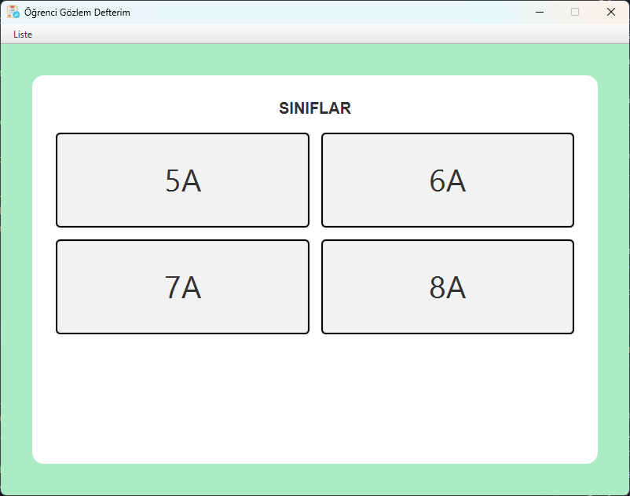
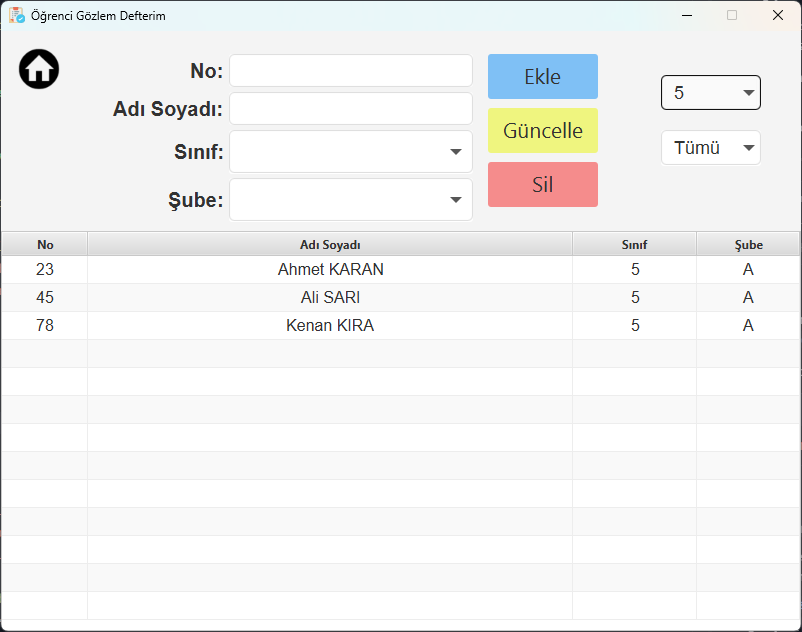
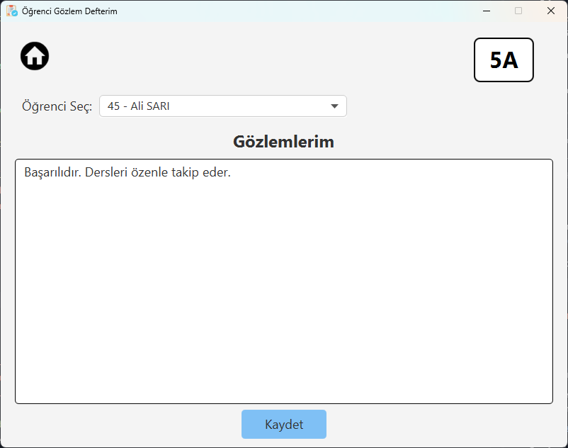

# Öğrenci Gözlem Defterim

Öğretmenler için tasarlanmış, geleneksel kağıt defterlerin yerini alan modern bir masaüstü uygulamasıdır. Bu proje, öğrenci gözlem ve görüş bilgilerini yönetmeyi ve her bir öğrenci için bu minvalde notlar tutmayı kolaylaştırır.

> **Not:** Ekran görüntülerinde yer alan tüm ad, soyad ve öğrenci bilgileri tamamen rastgele verilerden oluşmaktadır ve gerçek kişileri temsil etmemektedir.

## Uygulama Ekran Görüntüleri

### Ana Ekran
Uygulama açıldığında sınıfların listelendiği ve genel yönetimin sağlandığı ana paneldir.


### Öğrenci Liste Ekranı
Öğrencilerin listelendiği, yeni öğrenci eklendiği veya düzenlendiği ekrandır.


### Gözlem Kayıt Ekranı
Seçilen öğrenciye dair gözlem notlarının girildiği ve geçmiş kayıtların görüntülendiği alandır.


## Projenin Amacı

Bu uygulamanın temel hedefi, öğretmenlerin öğrencilerinin akademik ve sosyal gelişimlerini dijital bir platformda düzenli olarak takip edebilmelerini sağlamaktır. Öğrenci bilgilerine hızlı erişim ve gözlem kayıtları tutma imkanı sunarak eğitim sürecine destek olmayı amaçlar.

## Ana Özellikler

*   **Öğrenci Yönetimi:** Öğrenci listeleri oluşturun, bilgileri (isim, sınıf, şube, numara) güncelleyin.
*   **Gözlem Kayıtları:** Her bir öğrenciye gözlem notları ekleyin. Bu notlar, öğrencinin gelişimini izlemek için önemli bir kaynak oluşturur.
*   **Hızlı Filtreleme:** Sınıf ve şubeye göre filtreleme yaparak aradığınız öğrenciye saniyeler içinde ulaşın.
*   **Yerel Veritabanı:** Tüm veriler, bilgisayarınızda tek bir dosyada (SQLite) saklanır. Bu sayede internet bağlantısına ihtiyaç duymadan, güvenli ve taşınabilir bir kullanım sunar.
*   **Hata Yönetimi:** Uygulama, oluşan hataları otomatik olarak `error_log.txt` dosyasına kaydeder ve sistem bilgilerini loglar.

## Kullanılan Teknolojiler

*   **Programlama Dili:** Java 21
*   **Arayüz (UI):** JavaFX 21.0.2
*   **Veritabanı:** SQLite (sqlite-jdbc 3.46.1.0)
*   **Build Tool:** Gradle 8.x
*   **Paketleme:** JLink & JPackage (Beryx JLink Plugin 3.0.1)

## Proje Yapısı

```
src/main/java/com/hllsygn/ogrencigozlemdefterim/
├── controllers/          # UI kontrolcüleri (MainController, GozlemEkraniController, DatabaseController)
├── database/            # Veritabanı bağlantı ve DAO sınıfları
├── models/              # Veri modelleri (Ogrenci, Gozlem)
├── utils/               # Yardımcı sınıflar (ErrorLogger, AlertDialog, SceneController, PushAnimation)
├── fxmlfiles/           # FXML dosyaları (resources'ta)
├── styles/              # CSS stil dosyaları
└── Main.java            # Ana uygulama sınıfı
```

## Sistem Gereksinimleri

*   Java 21 veya üzeri
*   JavaFX 21.0.2
*   Gradle 8.x (wrapper dahil)
*   Windows/Linux/macOS

## Başlarken

### Geliştirme Ortamı

1.  Projeyi bir Java IDE'si (NetBeans, IntelliJ IDEA, Eclipse, vb.) ile açın.
2.  Java 21 JDK'nın kurulu ve yapılandırıldığından emin olun.
3.  Gradle wrapper kullanılarak bağımlılıklar otomatik olarak indirilecektir.
4.  Uygulamayı çalıştırdığınızda, gerekli veritabanı dosyası (`OgrenciVeritabani.db`) otomatik olarak oluşturulacaktır.

### Temel Gradle Komutları

```bash
# Uygulamayı çalıştırma
gradlew run

# Projeyi temizleme ve derleme
gradlew clean build

# Sadece derleme
gradlew build

# Testleri çalıştırma
gradlew test

# Tüm bağımlılıkları içeren JAR oluşturma
gradlew fatJar
```

### Dağıtım ve Paketleme

```bash
# JLink ile özel JRE oluşturma
gradlew jlink

# JLink çıktısını ZIP olarak paketleme
gradlew jlinkZip

# Platform-specific uygulama paketi oluşturma
gradlew jpackage

# Tümünü birlikte çalıştırma
gradlew clean jlink jpackage
```

### Uygulama Paketleme Çıktıları

Uygulama başarıyla paketlendiğinde, çalıştırılabilir dosyalar şu konumlarda oluşturulur:

*   **JPackage Çıktısı:** `build/jpackage-output/OgrenciGozlemDefterim/`
*   **JLink ZIP:** `build/distributions/app-[platform].zip`
*   **Fat JAR:** `build/libs/OgrenciGozlemDefterim-1.0.0-all.jar`

**Not:** MSI veya EXE installer oluşturmak için WiX Toolset gereklidir. Şu anda `skipInstaller = true` ayarı ile sadece uygulama image'ı (portable versiyon) oluşturulmaktadır.
